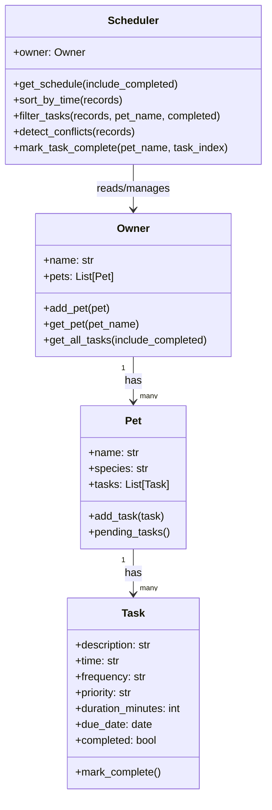

# PawPal+ (Module 2 Project)

PawPal+ is a smart pet care management system that helps owners organize daily routines for multiple pets.

## Scenario

A busy pet owner needs help staying consistent with pet care. The app supports:

- Tracking tasks such as feeding, walks, medications, and enrichment
- Organizing tasks with time and priority constraints
- Highlighting schedule conflicts before they cause issues
- Automatically rescheduling recurring daily and weekly tasks

## Features

- Object-oriented architecture with four core classes:
	- `Task`
	- `Pet`
	- `Owner`
	- `Scheduler`
- Streamlit UI connected to the backend logic in `pawpal_system.py`
- Multi-pet support
- Sorted schedule by date, time, and priority
- Filtering by pet and completion status
- Recurring task automation (`daily`, `weekly`)
- Conflict warnings for duplicate date/time slots
- Overlap conflict detection using duration-aware windows
- CLI demo script (`main.py`) to validate logic independently of UI
- JSON persistence (`pawpal_data.json`) with save/reload/reset controls in the UI
- Professional output formatting in both Streamlit and CLI (`tabulate` tables, status badges, emojis)

## Smarter Scheduling

The scheduling layer adds algorithmic intelligence:

- Sort by date/time/priority to produce a predictable daily plan
- Filter by pet name and completion state for focused views
- Detect exact-time conflicts and display warnings
- Detect duration-based overlapping tasks
- Generate next recurring task instance when a recurring task is completed
- Build a weighted priority schedule across all pets
- Generate a time-blocked non-overlapping plan
- Find the next available time slot in 15-minute increments

## Stretch Features Completed

### 1) Advanced Algorithmic Capability (+2)

- Added `next_available_slot()` to compute the next free slot based on existing tasks and duration.
- Added `generate_time_blocked_plan()` to automatically shift overlapping tasks while preserving priority.
- Agent-mode style prompting used: constrained prompts that requested algorithm behavior, edge-case handling, and deterministic outputs.

### 2) Data Persistence Layer (+2)

- Implemented `Owner.save_to_json()` and `Owner.load_from_json()`.
- UI now supports save/reload/reset of persistent data through `pawpal_data.json`.

### 3) Advanced Scheduling Logic (+2)

- Added weighted priority sorting (`sort_by_priority_then_time()`).
- Added overlap detection with duration-aware conflict checking.
- Added non-overlapping time-block plan generation.
- Visible in both CLI and Streamlit UI.

### 4) Professional UI and Output Formatting (+2)

- Streamlit schedule uses badges/emojis for priority, status, and frequency.
- Conflict and adjustment messages are surfaced with warning/info states.
- CLI output uses structured tables with `tabulate`.

### 5) Prompt/Model Strategy Comparison (+2)

- Reflection includes a direct comparison of broad prompts vs constrained prompts for complex scheduler tasks and which produced more reliable code.

## UML (Final)

Final Mermaid source is in `uml_final.mmd`.



## Project Structure

- `app.py`: Streamlit UI
- `pawpal_system.py`: OOP backend and scheduler algorithms
- `main.py`: CLI-first verification demo
- `tests/test_pawpal.py`: pytest suite
- `reflection.md`: design and AI collaboration reflection
- `uml_final.mmd`: final UML source

## Getting Started

### Setup

```bash
python -m venv .venv
.venv\Scripts\activate  # Windows PowerShell
pip install -r requirements.txt
```

### Run Streamlit App

```bash
streamlit run app.py
```

### Run CLI Demo

```bash
python main.py
```

## Testing PawPal+

Run tests with:

```bash
python -m pytest
```

Test coverage includes:

- Task completion status updates
- Task addition behavior
- Sorting correctness
- Daily recurrence creation
- Conflict detection for duplicate times
- Duration-aware overlap conflict detection
- Next available slot computation
- JSON save/load round trip

Confidence level: ★★★★☆ (4/5)

## Demo

Add a screenshot image file (for example `pawpal_demo.png`) and embed it here:

```html
<a href="/course_images/ai110/pawpal_demo.png" target="_blank"></a>
```
