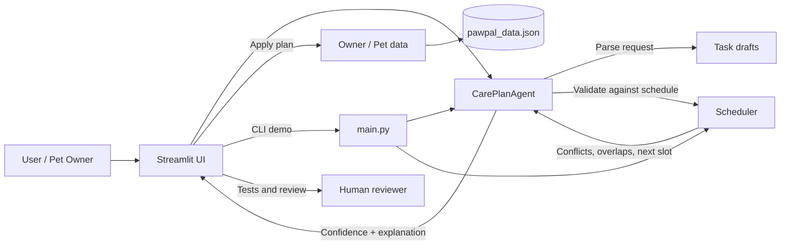

# PawPal+ Applied AI System

PawPal+ started as a Module 2 pet-care scheduler and was extended into an applied AI system that turns natural-language pet-care requests into validated schedules. The final version uses an agentic plan-check-repair loop instead of RAG because the problem is about reasoning over constraints, not looking up outside knowledge.

## Original Project

**Original project:** PawPal+ from Module 2.

The original PawPal+ project organized pet-care routines for multiple pets. It supported task creation, scheduling, sorting, filtering, recurring reminders, conflict detection, and JSON persistence through an object-oriented backend with a Streamlit UI.

## What This System Does

PawPal+ now behaves like a small AI care planner:

- it reads messy instructions such as "Mochi needs a morning walk at 08:00 and Luna needs medication after breakfast"
- it converts those instructions into structured task drafts
- it checks the plan against existing tasks for overlaps and exact conflicts
- it repairs the schedule by shifting tasks forward in 15-minute increments
- it reports a confidence score and explanation so the user can judge the result
- it keeps human approval in the loop before applying the plan to the schedule

## Architecture Overview

The system is organized around a deterministic scheduler plus an agentic planning layer.


```mermaid
flowchart LR
    U[User / Pet Owner] --> UI[Streamlit UI]
    UI --> AG[CarePlanAgent]
    AG -->|Parse request| D[Task drafts]
    AG -->|Validate against schedule| SCH[Scheduler]
    SCH -->|Conflicts, overlaps, next slot| AG
    AG -->|Confidence + explanation| UI
    UI -->|Apply plan| OWN[Owner / Pet data]
    OWN --> JSON[(pawpal_data.json)]
    UI -->|CLI demo| CLI[main.py]
    CLI --> AG
    CLI --> SCH
    UI -->|Tests and review| H[Human reviewer]
```

The source diagram is also saved in [assets/pawpal_system_architecture.mmd](assets/pawpal_system_architecture.mmd).

## Setup Instructions

1. Create and activate the virtual environment from the project root.

```powershell
.\.venv\Scripts\activate
```

2. Install dependencies.

```powershell
pip install -r .\ai110-module2show-pawpal-starter\requirements.txt
```

3. Run the Streamlit app.

```powershell
streamlit run .\ai110-module2show-pawpal-starter\app.py
```

4. Run the CLI demo.

```powershell
python .\ai110-module2show-pawpal-starter\main.py
```

5. Run the tests.

```powershell
python -m pytest .\ai110-module2show-pawpal-starter\tests\test_pawpal.py
```

## Sample Interactions

These examples match the current agentic planner behavior.

### Example 1
Input:
```text
Mochi needs a morning walk at 08:00 and Luna needs medication after breakfast.
```
Output:
```text
Confidence: 0.90
TASK: Mochi walk 08:00 once medium 30
TASK: Luna medication 08:30 once medium 10
```

### Example 2
Input:
```text
Mochi needs a walk at 08:00 and Mochi needs feeding at 08:00.
```
Output:
```text
Confidence: 0.90
TASK: Mochi walk 08:00 once medium 30
TASK: Mochi feeding 08:30 once medium 15
```

### Example 3
Input:
```text
Luna needs play time at 18:30 and Mochi needs a weekly training session after dinner.
```
Output:
```text
Confidence: 0.90
TASK: Luna play time 18:30 once medium 20
TASK: Mochi training 19:00 weekly medium 20
```

## Design Decisions

I kept PawPal+ deterministic at the core and added a lightweight agentic layer on top. That was the right tradeoff because the system needs reliable scheduling more than open-ended generation.

Important choices:

- The planner uses structured heuristics instead of an external model API, which keeps the project reproducible and easy to grade.
- The agent previews a plan first and only applies it after explicit human approval, which makes the workflow safer.
- Conflict repair happens in 15-minute increments, which is not globally optimal but is understandable, explainable, and easy to test.
- Confidence scoring is simple and visible, which makes the AI easier to trust.

I did not add RAG because this project does not need external knowledge retrieval. The meaningful AI behavior is planning, validation, and repair.

## Testing Summary

The repository includes automated pytest coverage for the original scheduler and the new agentic planner.

Current results:

- 10/10 tests passing
- recurrence generation works
- exact conflict detection works
- duration-based overlap detection works
- next-available-slot search works
- JSON persistence round-trip works
- agentic planning generates multi-step task plans
- agentic repair shifts overlapping tasks forward safely

## Reflection and Ethics

PawPal+ showed me that a trustworthy AI system is usually less about making the output look clever and more about constraining the behavior so it can be checked.

Limitations and risks:

- The planner is rule-based, so it can miss unusual phrasing.
- It does not reason about medical safety, travel time, or real pet-health data.
- It could be misused as if it were a veterinary assistant, so the README and UI should clearly frame it as a scheduling tool only.

What surprised me:

- The best reliability improvement came from forcing the agent to explain its own decisions and repair conflicts before the user applies the plan.
- The system felt more professional once the AI was constrained by tests instead of improvising freely.

AI collaboration:

- Helpful suggestion: AI helped point me toward a deterministic scheduler with a separate planning layer instead of overengineering the app with retrieval.
- Flawed suggestion: AI suggested a RAG-style architecture, but this problem does not require external document lookup, so that direction was rejected.

## Portfolio Notes

- GitHub repo: add your public repository link here.
- This project shows that I can take a small prototype, redesign it into a clearer AI system, and validate it with tests and guardrails.

## Project Files

- [app.py](app.py) - Streamlit UI
- [main.py](main.py) - CLI demo with agentic planning
- [pawpal_system.py](pawpal_system.py) - core data model, scheduler, and care-planning agent
- [tests/test_pawpal.py](tests/test_pawpal.py) - automated tests
- [model_card.md](model_card.md) - reflection, ethics, and reliability summary
- [assets/pawpal_system_architecture.mmd](assets/pawpal_system_architecture.mmd) - system architecture diagram source
